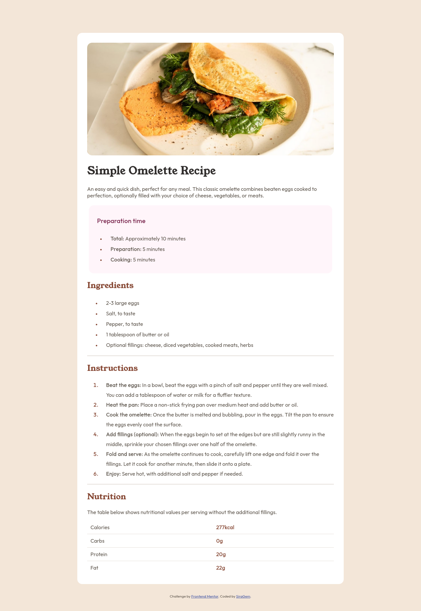

# Frontend Mentor - Recipe page solution

This is a solution to the [Recipe page challenge on Frontend Mentor](https://www.frontendmentor.io/challenges/recipe-page-KiTsR8QQKm). Frontend Mentor challenges help you improve your coding skills by building realistic projects. 

## Table of contents

- [Overview](#overview)
  - [The challenge](#the-challenge)
  - [Screenshot](#screenshot)
  - [Links](#links)
  - [Built with](#built-with)
  - [What I learned](#what-i-learned)
  - [Continued development](#continued-development)
- [Author](#author)

## Overview

This was my first completed challenge from Front End Mentor and it was really helpful to learn extra little CSS attributes that I hadn't used before.

### Screenshot



### Links

- Solution URL: [GitHub solution](https://github.com/SiraGem/FEM-RecipePage)
- Live Site URL: [GitHub live site](https://siragem.github.io/FEM-RecipePage/)

### Built with

- HTML5
- CSS

### What I learned

Use this section to recap over some of your major learnings while working through this project. Writing these out and providing code samples of areas you want to highlight is a great way to reinforce your own knowledge.

To see how you can add code snippets, see below:

```html
<h1>Some HTML code I'm proud of</h1>
```
```css
.proud-of-this-css {
  color: papayawhip;
}
```
```js
const proudOfThisFunc = () => {
  console.log('🎉')
}
```

### Continued development

In the future, I would like to focus on aligning all elements correctly and using margin and padding and spacing in the best way possible.

## Author

- GitHub - [SiraGem](https://www.your-site.com)
- Frontend Mentor - [@SiraGem](https://www.frontendmentor.io/profile/yourusername)

